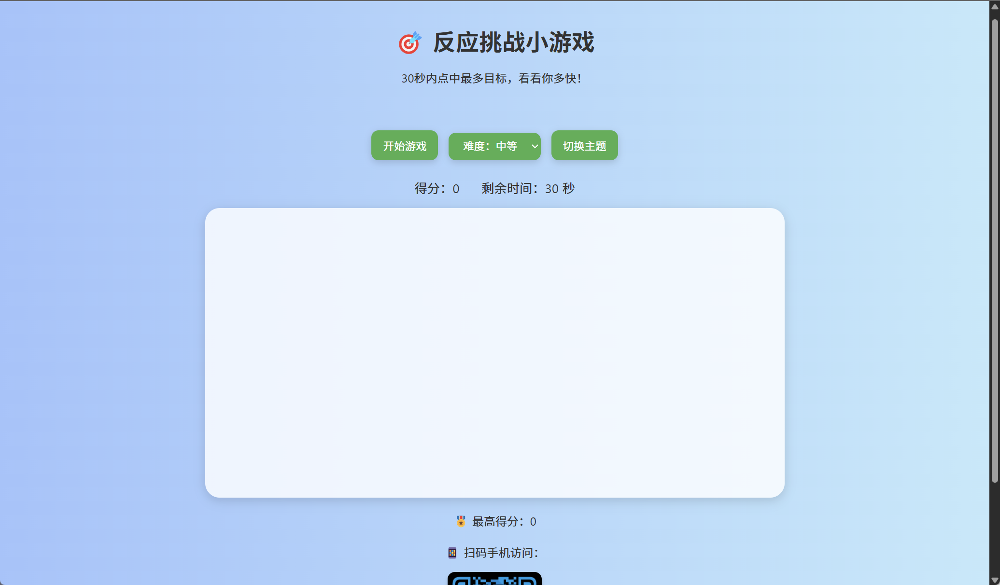

# ⚡️ 反应力挑战小游戏（Reaction Speed Game）

欢迎体验一款提升注意力和手速的网页小游戏 —— **反应力挑战**！  
这是一款操作简单却极富挑战性的小游戏，通过点击红色的圆来测试你的反应速度。

---

## 🔗 在线试玩地址

👉 [点击立即开始](https://17750977756.github.io/wll/)

或者扫码快速进入游戏：

<p align="center">
  
</p>
<p align="center">
  
</p>
---

## 🎮 游戏玩法

>  🔴 
屏幕上的红色的圆会在随机时间出现，你需要**第一时间点击它**。  
系统将记录你的反应时间，反应越快，得分越高！

---

## 🧩 游戏功能亮点

| 功能项 | 描述 |
|--------|------|
| 🕹️ 核心机制 | 点击绿色方块，测试反应时间 |
| 🎚️ 难度调整 | 提供简单 / 中等 / 困难 三档切换 |
| 🎨 主题切换 | 支持深色 / 浅色主题自定义切换 |
| 🔊 音效支持 | 点击有提示音反馈 |
| 🏆 排行榜记录 | 自动记录历史最佳反应时间，显示本地排行榜 |
| 📱 手机适配 | 响应式设计，支持手机和平板 |
| 🔁 多局模式 | 支持多轮快速挑战，数据实时刷新 |

---

## 💻 本地运行方法

```bash
git clone https://github.com/17750977756/wll.git
cd wll
open index.html  # 或直接用浏览器打开

